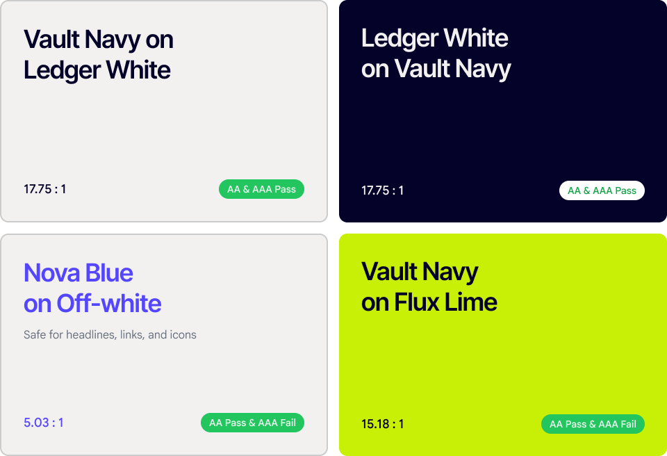

# Accessibility

Accessibility should be built into the system, not added as a final layer.

## Colour contrast



Ratios are computed from the real brand colours using the WCAG 2.1 relative-luminance formula, against Ledger White `#F2F1F0`.

| Pairing | Ratio | Grade |
|---|---|---|
| Vault Navy on Ledger White | 17.75 : 1 | AA + AAA pass |
| Ledger White on Vault Navy | 17.75 : 1 | AA + AAA pass |
| Vault Navy on Flux Lime | 15.19 : 1 | AA pass, AAA fail |
| Nova Blue on Ledger White | 5.04 : 1 | AA pass, AAA fail — headlines, links and icons only |

Full approved and forbidden pairings are in [colour.md](colour.md).

## Focus and interaction

Every interactive element must have a visible **2px Generic Black (`#000000`) focus outline** when users navigate with a keyboard. Never remove or hide the focus state.

```css
:focus-visible {
  outline: 2px solid var(--color-generic-100);
  outline-offset: 2px;
}
```

## Alt text

- Use empty `alt=""` for icon images, and provide the icon name through the button's `aria-label` and hover/focus tooltip. This ensures screen readers announce the icon name once rather than twice.
- For icons still named "Group…" in Figma, use their Figma ID as a temporary accessible name until they get a proper name. Never leave an interactive icon without a meaningful label.
- Provide meaningful alt text for informative images and illustrations.
- Use empty `alt=""` for purely decorative imagery.

## Best practices

**Do**

- Maintain sufficient colour contrast between text, icons, and their backgrounds.
- On a coloured background, use Vault Navy or Ledger White text — whichever contrasts more.
- Use Vault Navy for dense body copy where higher readability is required.
- Provide a visible focus state for every interactive element.
- Use descriptive labels for interactive icons and controls so their purpose is clear to screen readers.
- Ensure information is not communicated through colour alone.
- Keep text readable at different sizes and zoom levels.
- Respect reduced-motion preferences and avoid making interactions dependent on animation.

**Don't**

- Use low-contrast colour combinations for important text or UI elements.
- Use Nova Blue for small body text, where it fails the required contrast ratio.
- Remove or hide focus states from keyboard-accessible elements.
- Rely on colour alone to communicate errors, status, selection, or success.
- Use decorative icons as the only way to communicate an important action or status.
- Give informative images meaningless or generic alt text.
- Duplicate information by having screen readers read the same visible label and image description twice.
- Make custom cursors or hover effects essential for understanding or operating an interface.
- Use excessive motion without respecting `prefers-reduced-motion`.
- Sacrifice readability for visual styling when choosing brand colours.
