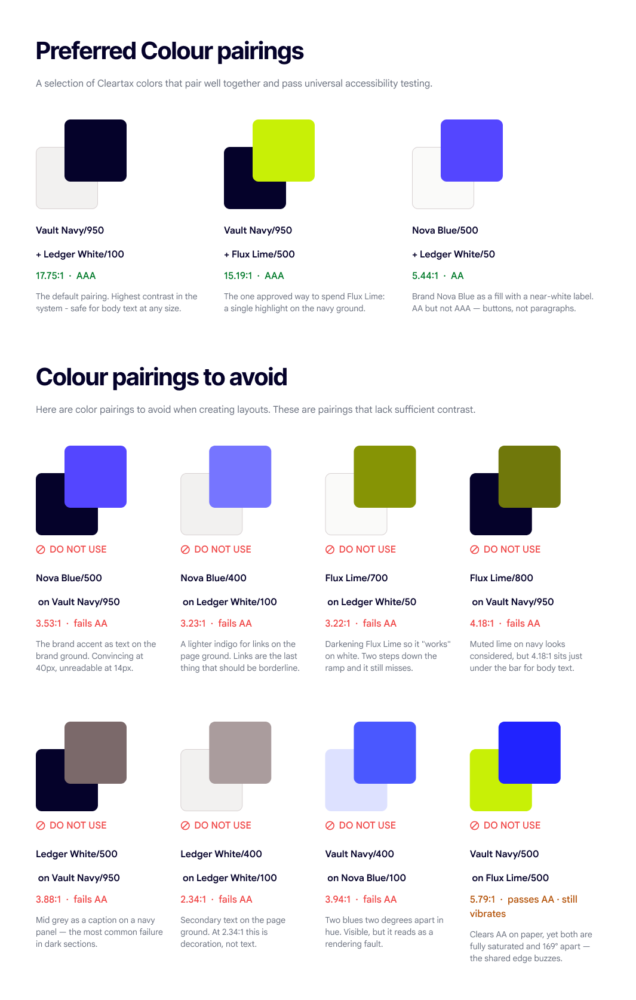
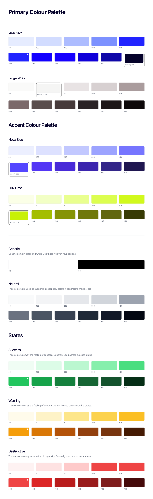

# Colour

## The idea behind the palette

Our palette is built the way our platform is built: every element has exactly one job, and none of them compete.

Most compliance software looks like the anxiety it manages — dense, blue-grey, defensive. Ours doesn't. We use a deep, near-black navy to hold authority, a warm off-white to create room to breathe, an electric blue to show the way forward, and a single charged lime to mark the one thing that matters most on any given screen.

Read in order, the four colours describe the life of a transaction: it is recorded (Ledger White), it is secured (Vault Navy), it is actioned (Nova Blue), and where necessary, it is flagged (Flux Lime). The palette is not decoration applied to the product. It is the product, expressed as colour.

## Core palette

| Colour | Hex | Token | Share of frame |
|---|---|---|---|
| Ledger White | `#F2F1F0` | `--color-ledger-white` | 60% |
| Vault Navy | `#05022A` | `--color-vault-navy` | 25% |
| Nova Blue | `#5446FF` | `--color-nova-blue` | 10% |
| Flux Lime | `#C8F006` | `--color-flux-lime` | 5% |

### Ledger White · `#F2F1F0`

The surface everything else is written on. Deliberately not pure white: a warm, paper-soft off-white that reads as considered rather than clinical, premium rather than sterile. Pure white is a screen default. This is a choice.

It carries the most fundamental idea in our brand — that clarity is created by what you remove. In a category where every competitor crowds the frame with data, our willingness to leave space is itself a statement of confidence. Only a company certain of its answer can afford to give it room.

- **Its job:** the ground. Backgrounds, canvases, cards, negative space, and the calm between elements. It should feel like the layout is breathing.
- **Never:** used as a text or accent colour, or replaced with pure `#FFFFFF` in brand applications.

### Vault Navy · `#05022A`

Where the brand's authority lives. Almost black, but not black — there's a violet depth in it that keeps it from feeling cold or corporate-generic. It is the colour of substance, permanence and safekeeping: the vault, the record, the thing that does not move.

This is the colour of our promise. When a CFO hands us the data that determines their legal standing, Vault Navy is the visual form of the assurance we give back. It carries seriousness without severity — the tone of an institution, but a modern one.

- **Its job:** all primary typography, the wordmark, headers, and dark-mode surfaces. Where the brand needs to feel solid and unmoved, this is the colour.
- **Never:** lightened into a mid-grey-blue, or used for interactive elements. Vault Navy *states*, Nova Blue *acts*.

### Nova Blue · `#5446FF`

The only colour in the palette with velocity in it. Electric, saturated, unmistakably digital — this is intelligence and technology made visible, the signal that something here is alive and can be acted on.

It is our direction giver. Against the stillness of Ledger White and the weight of Vault Navy, Nova Blue is the one thing moving, and that contrast is exactly why it works: on a calm surface, a single charged blue element becomes impossible to miss. It carries our engineering — the automation, the AI, the ten thousand invoices a second — without ever having to say so.

- **Its job:** primary CTAs, links, active and selected states, interactive controls, data highlights and illustration accents. If it's blue, it does something.
- **Never:** used as a background for long-form text, or applied so widely that it stops meaning "act here."

### Flux Lime · `#C8F006`

The sharpest instrument in the palette and the most disciplined. Charged, unexpected and unapologetically energetic, it is the colour of change in motion — the moment a threshold is crossed, a saving is found, a risk surfaces, a mandate goes live.

It exists because compliance is not a flat landscape. Somewhere in every screen, one number, one alert, one opportunity outranks everything else. Flux Lime is how we say so without shouting. It is also, quietly, our signal of innovation and optimism — proof that a compliance brand can have a pulse. Its power comes entirely from its scarcity. Used once, it is a spotlight. Used twice, it is noise.

- **Its job:** the single most important element in a view. Key metrics, critical alerts, a hero highlight, a moment of celebration.
- **The rule:** one instance per screen. If a designer needs two, one of them isn't important.
- **Never:** as body text on white or light backgrounds, or as a large background field.

## Colour usage ratio

**Ledger White 60% · Vault Navy 25% · Nova Blue 10% · Flux Lime 5%**

Four colours. Four jobs. Every layout is a hierarchy, and this is it.

Ledger White holds sixty percent of the frame — space is the majority shareholder. Vault Navy takes twenty-five, carrying the brand's weight and every word of substance. Nova Blue takes ten, marking the paths forward. Flux Lime takes five or less, and only ever once.

This ratio is not a stylistic suggestion. It is the mechanism that makes the palette work at all. Nova Blue and Flux Lime sit close to complementary on the colour wheel; at equal volume they fight, and the layout becomes loud and cheap. Kept to fifteen percent combined, they become precision instruments against a calm ground. Discipline in the palette is how the brand demonstrates discipline in the product. A crowded layout is a broken promise.

## Best practices

Four colours. Hold the ratio, stay inside the approved pairings, and never introduce a fifth.

**Do**

- Let Ledger White hold roughly 60% of the layout — the empty space is the design.
- Give every colour exactly one role: navy carries the brand, off-white holds the space, Nova Blue converts, Flux Lime highlights. That is what keeps layouts calm.
- Keep colour usage consistent across components.
- On a coloured background, use Vault Navy or Ledger White text — whichever contrasts more.
- Pull tints and shades from the Vault Navy, Nova Blue and Flux Lime ramps.

**Don't**

- Don't put colour on colour — Flux Lime on Nova Blue, or any pair of the four.
- Don't introduce a fifth brand colour, or tint Vault Navy to invent a new one.
- Don't spend Flux Lime twice on a screen. Imagine you only have permission to use it once or twice in an entire URL.
- Don't set body copy in Flux Lime, and keep Flux Lime plus Nova Blue together under 15%.
- Don't use Flux Lime for large areas of dense content.

## Approved pairings

| Pairing | Ratio | Grade | Use |
|---|---|---|---|
| Vault Navy on Ledger White | 17.75 : 1 | AAA | The default. Safe for body text at any size. |
| Vault Navy on Flux Lime | 15.19 : 1 | AAA | The one approved way to spend Flux Lime — a single highlight on the navy ground. |
| Nova Blue on Ledger White | 5.04 : 1 | AA | Buttons, links, icons. Not long-form body copy. |

### Do not use

| Pairing | Ratio | Why |
|---|---|---|
| Nova Blue 500 on Vault Navy 950 | 3.53 : 1 | Fails AA. Convincing at 40px, unreadable at 14px. |
| Nova Blue 400 on Ledger White | 3.23 : 1 | Fails AA. Links are the last thing that should be borderline. |
| Flux Lime 700 on Ledger White | 3.22 : 1 | Fails AA. Two steps down the ramp and it still misses. |
| Flux Lime 800 on Vault Navy 950 | 4.18 : 1 | Fails AA. Muted lime on navy looks considered, but sits just under the bar for body text. |
| Ledger White 500 on Vault Navy 950 | 3.88 : 1 | Fails AA. The most common failure in dark sections. |
| Ledger White 400 on Ledger White 100 | 2.34 : 1 | Fails AA. Decoration, not text. |
| Vault Navy 400 on Nova Blue 100 | 3.94 : 1 | Fails AA. Two blues two degrees apart — reads as a rendering fault. |
| Vault Navy 500 on Flux Lime 500 | 5.79 : 1 | Passes AA but still vibrates — fully saturated, 169° apart, the shared edge buzzes. |

## Ramps

Ramps exist for tints, shades, borders, hovers and state surfaces. **The core hexes above are the brand; the ramps are supporting material.** Never substitute a ramp step for a core colour.

### Vault Navy

| 50 | 100 | 200 | 300 | 400 | 500 | 600 | 700 | 800 | 900 | 950 |
|---|---|---|---|---|---|---|---|---|---|---|
| `#E6ECFF` | `#D2DCFF` | `#ADBCFF` | `#7C91FF` | `#2123FF` | `#2123FF` | `#1200FF` | `#1600FF` | `#1000D9` | `#0F07A8` | `#05022A` |

### Ledger White

| 50 | 100 | 200 | 300 | 400 | 500 | 600 | 700 | 800 | 900 | 950 |
|---|---|---|---|---|---|---|---|---|---|---|
| `#FAFAF9` | `#F5F5F4` | `#E8E3E4` | `#D7D0D1` | `#AA9C9D` | `#7B696A` | `#594D4C` | `#463A3A` | `#2A2325` | `#1D1617` | `#0D0809` |

### Nova Blue

| 50 | 100 | 200 | 300 | 400 | 500 | 600 | 700 | 800 | 900 | 950 |
|---|---|---|---|---|---|---|---|---|---|---|
| `#ECEFFF` | `#DDE1FF` | `#C2C8FF` | `#9CA3FF` | `#7675FF` | `#5446FF` | `#5336F5` | `#482AD8` | `#3B25AE` | `#332689` | `#1F1650` |

### Flux Lime

| 50 | 100 | 200 | 300 | 400 | 500 | 600 | 700 | 800 | 900 | 950 |
|---|---|---|---|---|---|---|---|---|---|---|
| `#FBFFE7` | `#F2FFC5` | `#E9FF8F` | `#DCFE4F` | `#D1F91C` | `#C8F006` | `#A4BE01` | `#869405` | `#70780B` | `#61660F` | `#373A04` |

### Neutral

Supporting secondary colours for separators, modals, and similar.

| 50 | 100 | 200 | 300 | 400 | 500 | 600 | 700 | 800 | 900 | 950 |
|---|---|---|---|---|---|---|---|---|---|---|
| `#F9FAFB` | `#F3F4F6` | `#E5E7EB` | `#D1D5DB` | `#9CA3AF` | `#6B7280` | `#4B5563` | `#374151` | `#1F2937` | `#111827` | `#030712` |

### Generic

Black and white, used freely. `--color-generic-00: #FFFFFF` · `--color-generic-100: #000000`.

## State colours

### Success

| 50 | 100 | 200 | 300 | 400 | 500 | 600 | 700 | 800 | 900 | 950 |
|---|---|---|---|---|---|---|---|---|---|---|
| `#F0FDF4` | `#DCFCE7` | `#BBF7D0` | `#86EFAC` | `#4ADE80` | `#22C55E` | `#16A34A` | `#15803D` | `#166534` | `#14532D` | `#052E16` |

### Warning

| 50 | 100 | 200 | 300 | 400 | 500 | 600 | 700 | 800 | 900 | 950 |
|---|---|---|---|---|---|---|---|---|---|---|
| `#FFFBEB` | `#FEF3C7` | `#FDE68A` | `#FCD24D` | `#FBBF24` | `#F59E0B` | `#D97706` | `#B45309` | `#92400E` | `#78350F` | `#451A03` |

### Destructive

| 50 | 100 | 200 | 300 | 400 | 500 | 600 | 700 | 800 | 900 | 950 |
|---|---|---|---|---|---|---|---|---|---|---|
| `#FEF2F2` | `#FEE2E2` | `#FECACA` | `#EF4444` | `#EF4444` | `#EF4444` | `#DC2626` | `#B91C1C` | `#991B1B` | `#7F1D1D` | `#450A0A` |

> Known defects in the ramps as exported from Figma — see [open-questions.md](open-questions.md):
> Ledger White's core hex `#F2F1F0` appears nowhere in its own ramp; Vault Navy 400 = 500;
> Vault Navy 600 is darker than 700; Destructive 300 = 400 = 500.
