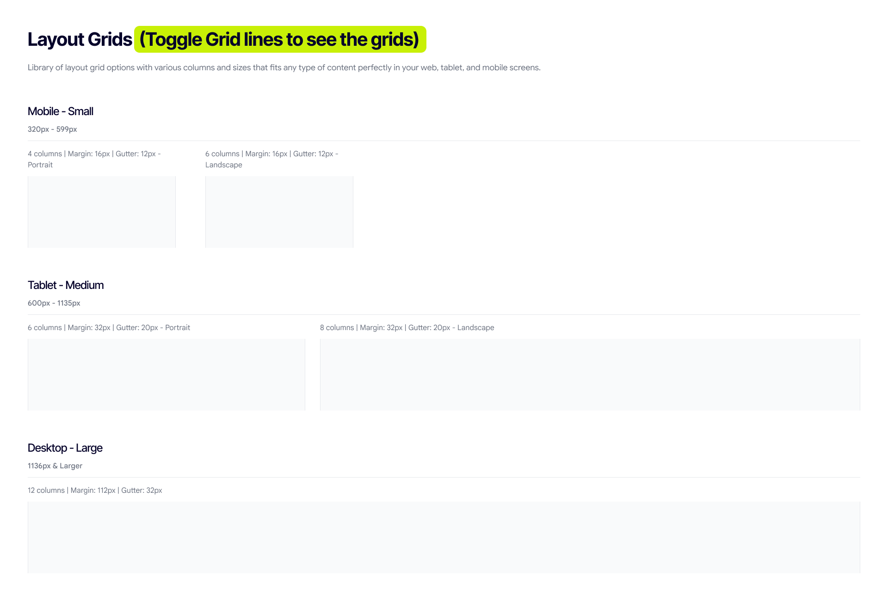

# Layout grid

A responsive grid system adapts to screen size and orientation, and ensures consistency and hierarchy across layouts.

## Columns, gutters, and margins

**Columns.** Most content is placed in the areas of the screen that contain columns. The number of columns displayed is determined by the breakpoint range — a range of predetermined screen sizes. A breakpoint can correspond with mobile, tablet, or other screen types.

**Gutters.** A gutter is the space between columns that helps separate content. Gutter widths are fixed values at each breakpoint range, and can change between breakpoints. Wider gutters suit larger screens, as they create more open space between columns.

**Margins.** Margins are the space between content and the left and right edges of the screen. Margin widths are defined using fixed or scaling values at each breakpoint, and can change between breakpoints. Wider margins suit larger screens, as they create more whitespace around the content.

## Brand grid spec

| Range | Viewport | Columns | Margin | Gutter |
|---|---|---|---|---|
| Mobile — Small | 320–599px | 4 (portrait) / 6 (landscape) | 16px | 12px |
| Tablet — Medium | 600–1135px | 6 (portrait) / 8 (landscape) | 32px | 20px |
| Desktop — Large | 1136px+ | 12 | 112px | 32px |

## How this repo implements it

**Breakpoints stay on Tailwind's defaults** (`sm` 640 · `md` 768 · `lg` 1024 · `xl` 1280 · `2xl` 1536, plus the project's `xl2` at 1400). We deliberately do not adopt the brand's 600 / 1136 cut points — Tailwind's defaults bracket the same ranges closely enough, and diverging from them costs more in developer confusion than it buys in fidelity.

**Container width is `--container-max` (1328px), applied through Tailwind's standard `container` utility.** Do not hand-roll a container class, and do not use `max-w-[…]` for page width. If the container width needs to change, change it in one place — the `@utility container` block in `src/styles/shared.css` — so every page moves together.

The brand's fixed 112px desktop margin is not implemented literally; it would produce a 2336px content area at 2560px viewport, which is not the intent. The container's centred max-width achieves the same visual result at real laptop sizes.

**Gutters** map to Tailwind gap utilities: `gap-3` (12px) mobile, `gap-5` (20px) tablet, `gap-8` (32px) desktop.

## Best practices

**Do**

- Align content to the grid. Use columns and gutters as consistent alignment points for text, images, and components.
- Preserve the same grid logic within each breakpoint. Let the number of columns, gutters, and margins change only according to the defined responsive rules.
- Use the grid to establish hierarchy — wider spans for primary content, narrower spans for supporting content.
- Allow elements to span multiple columns when needed. Use intentional spans rather than forcing every element into a single column.
- Maintain consistent horizontal alignment. Related sections should share common starting and ending points where possible.
- Design for the smallest supported viewport first, so content reflows naturally as the grid expands.

**Don't**

- Don't align elements by eye when a grid alignment point is available.
- Don't create custom gutters or margins for individual components without a clear layout requirement.
- Don't mix different grid systems on the same breakpoint.
- Don't force content to fill every column. Empty grid space can be intentional and helps create hierarchy.
- Don't let components break the grid without purpose. Full-bleed elements should be an intentional exception, not an accidental misalignment.
- Don't use the grid as a decorative element. Grid lines are a structural guide and should not influence the visual styling of the final interface.
