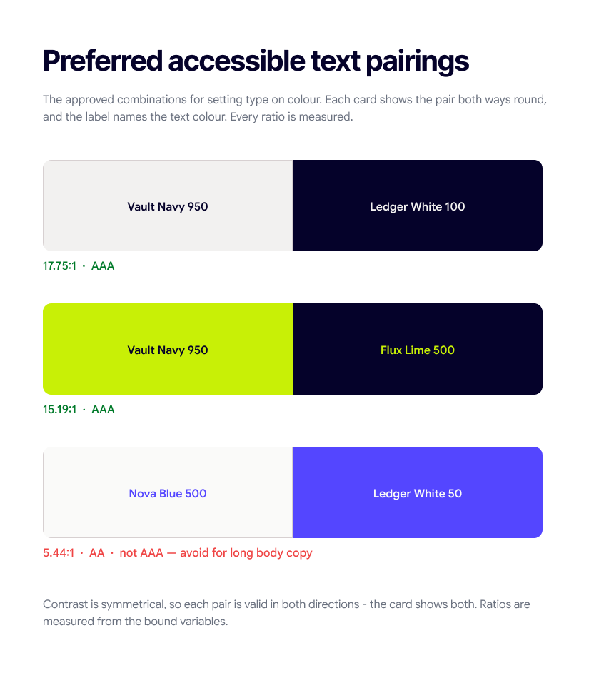

# Typography

## What we needed the type to do

Our typography has to work across the website, campaigns, sales decks, whitepapers, event assets and documents, in the hands of marketers, agencies and partners across every market we operate in. It has to hold a headline on a six-metre backdrop and a footnote in a sixty-page PDF.

It also has to solve a specific problem. Every tax and compliance platform we compete with is set in some variation of a corporate grotesque, and the whole category reads as cold and slightly defensive. We wanted a system with authority in it, without inheriting that chill.

## Why two families and not one

Inter Tight alone would have worked. It has a text cut, it is highly legible, and one family is simpler to manage. We rejected it because Inter is a neutral grotesque all the way through, and a brand built entirely on it lands exactly where the category already is. We would have looked correct and forgettable.

Google Sans alone would also have worked, and it fails in the other direction. Its geometric roundness is friendly at paragraph size and goes soft at headline size, where a claim needs to feel settled and immovable.

So we split the roles. **Inter Tight where we assert. Google Sans where we explain.** One family would have been easier to run. Two is the only way to get authority and approachability into the same page without one cancelling the other.

## Primary typeface — Inter Tight

**Display, H1–H6.** Headlines, hero lines, campaign lines, section titles, cover slides and large display figures.

Inter Tight is the close-spaced cut of Inter. The tight setting is the reason we chose it. Set large, the words pull into a single block instead of drifting apart into a string of letters, so the line holds as one shape. It also keeps long terms on one line — "Continuous compliance, without borders" and "Input tax credit reconciliation" are lines we have to set in banners and on covers, and a wider face breaks them across two.

The letterforms carry no stylistic quirks. No unusual terminals, no distinctive *g*, nothing that dates. Our headlines are usually the entire idea, and a typeface with an accent competes with them.

It is a variable font from thin to black, so one file gives us the full hierarchy and the site stays light.

## Secondary typeface — Google Sans

**Body copy, paragraphs, labels, overlines, captions and long-form documents.**

The main reason is the wordmark. The cleartax logotype is drawn from a geometric skeleton with circular forms, soft terminals and an even stroke weight, and Google Sans is built from the same vocabulary. Put the logo above a paragraph and they read as related. Set the same paragraph in Inter and they read as two decisions made by two people. This is the one argument in this section you can verify by looking.

The second reason is temperature. Round bowls, open counters and soft terminals make it noticeably warmer than a grotesque at paragraph size, and that is where people spend real time with us: whitepapers, guides, mandate explainers, case studies. It is also what keeps the overall system from tipping cold, since Vault Navy, tight headlines and disciplined layouts are all pulling the other way.

## Licensing and loading

Both families are on Google Fonts under the SIL Open Font License 1.1 — free to self-host, redistribute, and use commercially. Nothing to buy, renew, or clear when handing assets to an agency or partner in a new market.

| Family | Axes | Range |
|---|---|---|
| Inter Tight | `wght` | 100–900 |
| Google Sans | `wght`, `opsz`, `GRAD` | 400–700, opsz 17–18 |

```html
<link rel="preconnect" href="https://fonts.googleapis.com">
<link rel="preconnect" href="https://fonts.gstatic.com" crossorigin>
<link href="https://fonts.googleapis.com/css2?family=Inter+Tight:wght@400..700&family=Google+Sans:opsz,wght@17..18,400..700&display=swap" rel="stylesheet">
```

**Google Sans Text does not exist on Google Fonts** — the family list is Google Sans, Google Sans Code (monospace) and Google Sans Flex. The "reading cut tuned for small sizes" is the `opsz` axis instead, so set `font-optical-sizing: auto` and small text picks it up automatically. This is already handled in `src/styles/tokens.css`.

Both sit in the Google ecosystem, so when someone opens Slides or Docs at short notice the brand fonts are already in the menu. Add both to the organisation's Workspace font list so they load by default rather than sitting behind the "more fonts" menu, and build the Slides and Docs templates on them.

## Numbers

Our proof is numerical, so figures get set with intent.

- **Hero statistics go in Inter Tight.** A number that large is doing the job of a headline, and the tight setting keeps the digits together as one shape.
- **Anything in a column uses tabular figures**, via the OpenType `tnum` feature. Both families support them. Proportional figures shift digits between rows, which makes a comparison table or a pricing grid hard to scan. Tabular figures line every decimal point down the page.
- **Running prose uses proportional figures**, where even spacing reads better and nothing needs to align.

Use the `.nums-tabular` helper in `shared.css` for any column of figures.

## Typography in use

Two families, one hierarchy: they never cross. A heading is never set in Google Sans, and body copy is never set in Inter Tight.

| Usage | Font | Size / line | Tracking | Case |
|---|---|---|---|---|
| Display | Inter Tight Bold | 52 / 56 | −0.5px | Sentence |
| Page heading (H1) | Inter Tight Bold | 40 / 48 | −0.5px | Sentence |
| Section header (H2) | Inter Tight Semibold | 36 / 44 | −0.5px | Sentence |
| Subhead (H5) | Inter Tight Medium | 24 / 32 | −0.5px | Sentence |
| Body copy | Google Sans Medium | 16 / 24 | 0 | Sentence |
| Overline | Google Sans Semibold | 12 / 20 | +1px | UPPERCASE |
| Button ("Book a demo") | Google Sans Semibold | 16 / 18 | 0 | Sentence |

Rules:

- Headlines are always **sentence case** — capitalise only the first word and any proper noun. Section headers, subheads and CTAs follow the same rule.
- Display and heading styles carry **−0.5px tracking**; the type is tight by design.
- Paragraph and label tracking sits at **0**.
- **Overline is the only style that opens up**, at +1px tracking, and the only one set in uppercase.
- Font weights **never reach past Bold (700)**.
- Always avoid widows and orphans.

## Scale

### Display

Hero sections only.

| Style | Size | Line height |
|---|---|---|
| Display XLarge | 80px | 88px |
| Display Large | 52px | 56px |
| Display Small | 44px | 48px |

### Headings — desktop

| Style | Size | Line height |
|---|---|---|
| H1 Large | 56px | 64px |
| H1 | 40px | 48px |
| H2 | 36px | 44px |
| H3 | 32px | 40px |
| H4 | 28px | 36px |
| H5 | 24px | 32px |
| H6 | 20px | 28px |

### Headings — mobile

| Style | Size | Line height |
|---|---|---|
| H1 Large | 48px | 56px |
| H1 | 36px | 44px |
| H2 | 32px | 40px |
| H3 | 28px | 36px |
| H4 | 24px | 32px |
| H5 | 20px | 28px |
| H6 | 18px | 24px |

### Paragraph

| Style | Size | Line height |
|---|---|---|
| Large | 18px | 28px |
| Medium | 16px | 24px |
| Small | 14px | 20px |
| XSmall | 12px | 20px |

### Label

| Style | Size | Line height |
|---|---|---|
| Large | 16px | 18px |
| Medium | 14px | 16px |
| Small | 12px | 16px |
| XSmall | 10px | 14px |

## Best practices

**Do**

- Maintain sufficient contrast between text and its background for readability.
- Use appropriate font weights to create hierarchy without overusing bold styles.
- Keep line lengths comfortable, especially for paragraphs and long-form content.
- Use consistent letter spacing based on the defined typography system.
- Align text consistently with the layout and surrounding elements.
- Test typography across different screen sizes to ensure readability and hierarchy are preserved.

**Don't**

- Use unapproved fonts or substitute typefaces.
- Mix multiple typefaces without a defined purpose.
- Use too many font weights within the same layout, or multiple font weights inside one headline.
- Use heavy font weights for headlines.
- Stretch, condense, skew, or otherwise distort typefaces.
- Stroke type to add weight.
- Adjust letter spacing arbitrarily to force text into a space.
- Set line spacing too tight or too loose.
- Use all caps for long passages or body copy, or set headlines in all lowercase.
- Add icons or images inline between words of running text.
- Use the cleartax logo within text.
- Sacrifice readability for visual impact.
- Use inconsistent font sizes or line heights for the same content level.
- Place text over busy backgrounds without ensuring adequate contrast.
- Use typography as decoration when it compromises clarity or accessibility.

## Accessible text pairings



Contrast is symmetrical, so each pair is valid in both directions.

| Text on background | Ratio | Grade |
|---|---|---|
| Vault Navy on Ledger White · Ledger White on Vault Navy | 17.75 : 1 | AAA |
| Vault Navy on Flux Lime · Flux Lime on Vault Navy | 15.19 : 1 | AAA |
| Nova Blue on Ledger White · Ledger White on Nova Blue | 5.04 : 1 | AA — avoid for long body copy |
